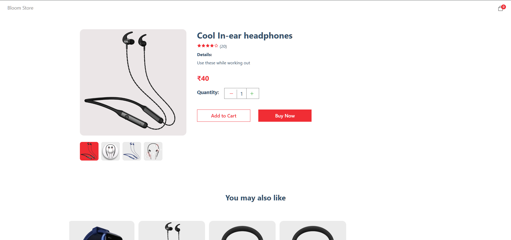

# Basic eCommerce Application

## Overview

This is a basic eCommerce application built using Next.js. The application allows users to browse products, add them to the cart, and proceed to checkout using Stripe for payment processing. The application also leverages Sanity for managing product data.

## Table of Contents

- [Features](#features)
- [Technologies Used](#technologies-used)
- [Getting Started](#getting-started)
- [Running the Application](#running-the-application)
- [Scripts](#scripts)
- [Dependencies](#dependencies)
- [License](#license)

## Features

- Product listing and details
- Shopping cart functionality
- Secure checkout with Stripe
- Product data management with Sanity

## Technologies Used

### Frontend

- Next.js
- React
- React Icons
- React Hot Toast
- Next Sanity Image
- Canvas Confetti

## Getting Started

### Prerequisites

- Node.js (v14 or higher)

### Installation

1. **Clone the repository:**

    ```bash
    git clone https://github.com/your-username/ecommerce.git
    cd ecommerce
    ```

2. **Install dependencies:**

    ```bash
    npm install
    ```

## Running the Application

### Development

1. **Start the development server:**

    ```bash
    npm run dev
    ```

2. **Open [http://localhost:3000](http://localhost:3000) to view it in the browser.**

### Production

1. **Build the application:**

    ```bash
    npm run build
    ```

2. **Start the production server:**

    ```bash
    npm start
    ```

## Scripts

- `npm run dev`: Starts the development server.
- `npm run build`: Builds the application for production.
- `npm start`: Starts the production server.
- `npm run lint`: Runs ESLint to check for linting errors.

- 

## Dependencies

### Production Dependencies

- `@babel/core`
- `@sanity/client`
- `@sanity/image-url`
- `canvas-confetti`
- `next`
- `next-sanity-image`
- `react`
- `react-dom`
- `react-hot-toast`
- `react-icons`
- `stripe`

### Development Dependencies

- `@babel/preset-react`
- `eslint`
- `eslint-config-next`

